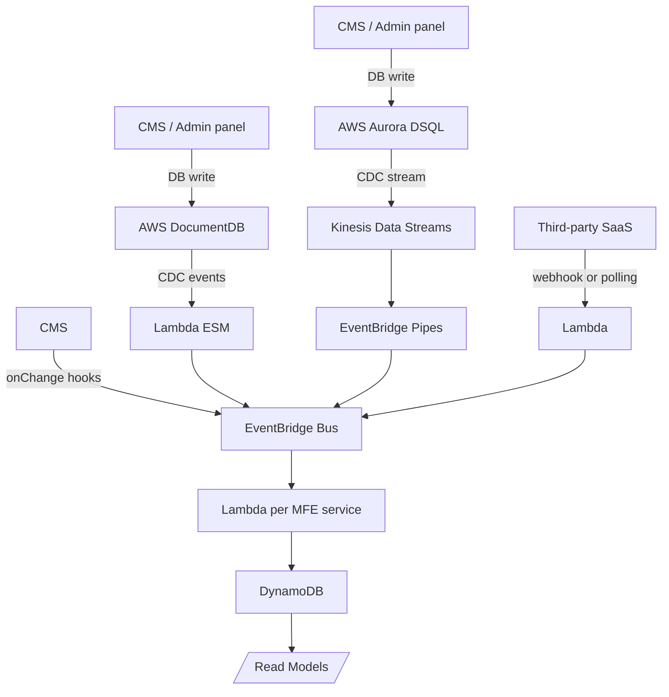
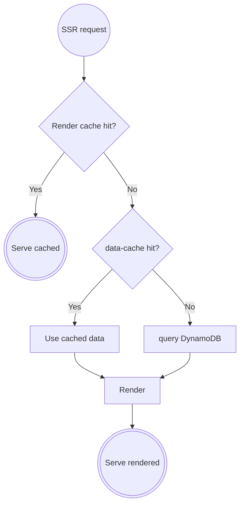
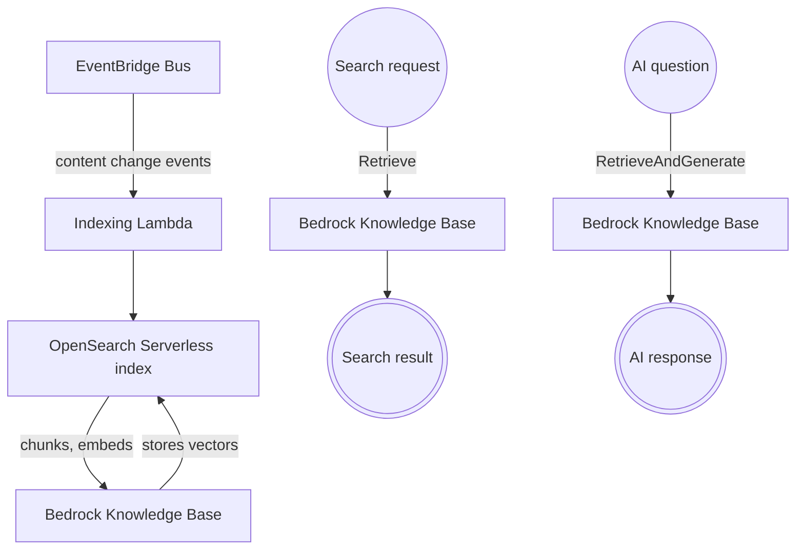

# Composable distributed DXP (Digital Experience Platform): Enterprise Architecture Case Study  

Created by: Tamas Horvath  
Last updated: 2026-06-02

## Executive Summary

A high-level architectural proposal for a **composable DXP (Digital Experience Platform)**. The presented technical solution is aligned with the operational constraints and strategic business realities discussed under **Guiding Principles** and **Business Context**. Unlike a traditional CMS — which enforces a single, unified content model — this composable DXP consists of multiple specialised content models and related tools, integrated into a unified experience. This approach shift and its benefits are discussed in Chapter 3. The architecture connects the admin side and the presentation side through an event-driven pipeline, separating authoring from delivery via CQRS, and deploys across multiple regions with a layered caching strategy. This document covers change capture, event pipeline design, framework selection, authentication, observability, cross-app integration patterns, and infrastructure decisions. Implementation details, data models, IaC, and networking configuration are out of scope.
 
## Guiding Principles
An Enterprise web platform is not only a technical problem. A platform serving multiple departments operates inside real organisational constraints: teams have different priorities and delivery timelines, budgets don't align, some departments will adopt eagerly while others resist change, and the risk of disrupting existing workflows is a legitimate concern. A system that requires full cross-department commitment and full implementation before delivering value will stall in procurement and planning.

The decoupling that makes this architecture look complex on a diagram is precisely what makes it safe to introduce incrementally. Each boundary that looks like overhead becomes a seam you can use to stage delivery and more importantly continiously adapt to future needs (including framework and technology changes) without architectural redesign. 

See how the axes of gradual introduction map cleanly onto the architectural boundaries in Chapter 15.

This work proposes an AWS cloud native design that can safely handle enterprise requirements, but the architectural patterns can be implemented with any major cloud provider or with self-deployed open-source tools. 

## 1. Business Context and High-Level Requirements

### Scope

Fpr mid-to-large enterprises operating a public-facing web platform (DXP) serving multiple internal departments, each with distinct content authoring needs, data models, and publishing process. The website must present a unified experience to end users while allowing each department to own and evolve its content independently.

The architecture described in this document is **pattern-driven**. The business domains below are used as examples, but each domain is chosen because it illustrates a distinct integration and composition pattern that recurs across enterprise web platforms. The patterns generalise beyond the examples.

### Architectural Patterns Illustrated

| Pattern | Example Domain | Description |
|---|---|---|
| **Large Host Application** | Marketing, Education | A full host app with its own design system, shell, and Micro-frontend (MFE) composition surface. Two instances show that the same architecture supports multiple distinct products. |
| **Small Domain Micro-frontend (MFE)** | Legal | A focused content domain with no dedicated host. Content is exposed as MFEs integrated into an existing host app. |
| **In-House External System** | Webshop | A separately owned and deployed internal system. This architecture consumes its data read-only. |
| **Third-Party Read-Only Integration** | Events SaaS | An external SaaS platform. Data is ingested via webhook or polling, normalised, and fed into the internal event pipeline. No write-back. |
| **Cross-App Thin Coupling** | Webshop cart icon | A lightweight synchronous data dependency between two separate applications. |

### Domain Summary

| Domain | Ownership | Content Type | Admin Surface |
|---|---|---|---|
| Marketing | Internal | Landing pages, product pages, campaigns | Headless CMS |
| Education | Internal | Video courses, learning modules | Headless CMS or custom admin panel |
| Legal | Internal | Policy pages, compliance documents | Lightweight headless CMS or owned panel |
| Events | 3rd Party Integration (SaaS) | Event catalogue, session agendas | External — no admin surface in this system |
| Webshop | Internal (separate system) | Product catalogue, cart state | Separate system — read-only from this architecture |
  
### Key Non-Functional Requirements

**Availability & Scale**
- Low latency in multiple regions for the presentation layer.
- Presentation layer scales horizontally.
- Admin/CMS do not require horizontal scaling and are managed independently.

**Consistency Model**
- Eventual consistency is acceptable for content propagation from authoring to presentation.
- No synchronous data coupling between write and read sides.

**Authentication**
- Internal admin users: SSO via the company's admin directory (OpenID Connect or SAML 2.0 compatible).
- End users: SSO via the company's centralised identity directory (OpenID Connect or SAML 2.0 compatible).
- The presentation layer has no public API surface exposed to end users.

**Integration Boundaries**
- The 3rd party Events SaaS and the Webshop are read-only data sources. Any transactional action (event registration, cart/checkout) is handled by redirecting the user to the respective external or separate frontend.

**Coupling & Autonomy**
- Domains must be decoupled at the data level. A change in one domain's admin panel or data model must not require changes to another domain's authoring and presentation component.


## 2. Domain & Integration Overview

### Large Host Applications (Marketing, Education)

Marketing and Education are two large, distinct applications. They share the same underlying architecture — the same MFE framework, service layer (BFF pattern), caching strategy, and event pipeline — but are independently deployed with separate design systems, React singleton contexts, and host shells. They are not the same app with different content, they are two separate products that are built on the same platform.

The two hosts may be connected by integration: for example, the Marketing host using Edu content or a training recommendation component can be surfaced either via Data sharing (EventBridge Bus) or MFEs via application-level Module Federation. This demonstrates that composition can cross host boundaries without requiring shared deployment or a monolithic shell.

### Small Domain MFE (Legal)

Legal is a focused content domain that does not require its own host application. Its content (policy pages, compliance documents) is exposed as one or more small MFEs — a document viewer, a policy index — and integrated into the Marketing host. Legal owns its admin panel and read model but has no dedicated frontend shell. This is the pattern for domains that need content autonomy without product-level independence.

### In-House External System (Webshop)

The Webshop is an internally owned but separately deployed system with its own architecture, team, and deployment lifecycle. This architecture treats it as a read-only data source: product data (titles, descriptions, images, pricing) is consumed for recommendation widgets. Cart state is consumed for the cart icon. No checkout or cart management is implemented here, any transactional action is a redirect to the Webshop's own frontend.

### Third-Party Read-Only Integration (Events SaaS)

The Events SaaS is an external platform that manages the full event lifecycle. This architecture ingests event catalogue and agenda data one-way — via webhook (push) or periodic API polling (pull) — normalises it into the internal schema, and feeds it into the event pipeline similarly as first-party content. No write operations are performed against the SaaS platform. Any user action (registration, RSVP) is a redirect to the SaaS platform's own frontend.


## 3. The Composable DXP in Context
 
A **traditional CMS** couples content and presentation. The CMS owns both, one system, one content model, one presentation layer built into or tightly coupled to the CMS (e.g. Wordpress). 
 
A **headless CMS** decouples content from presentation. Structured content is stored in the CMS, a separate frontend renders it. But the typical headless setup still implies a single, centralised content model.
 
**This Composable DXP platform extends this in multiple directions simultaneously.**
 
**Each domain owns its content model entirely.** Domain separation at the content model and authoring layer. Marketing's schema evolving for a new campaign has zero effect on Legal's content model. Education can introduce new content types without involving any other domain. The content model is not a shared resource, it is a domain boundary, owned and managed by the domain's team in independent headless CMSs or admin panels.
 
**The presentation layer composes across those independent domains**. 
- MFEs do not passively mirror individual domain models. Each build its own content model shaped by presentatin needs. The model is a custom composite projection of the available domain models, built programatically (Event bus Lambda consumers) with well defined schema (Read model).
- Read models are updated on data change. There is no request time multi-domain aggregation.
- Frontends read denormalised, presentation optimized read models. This requires a very thin data-access layer that fits perfectly in server components.

**The architecture defines exact contract boundaries and recommends a reliable, scaleable way to implement them.**
 
### Roles and Responsibilities
 
The composable model maps cleanly onto three distinct roles, each with a single, well-defined domain of responsibility:
 
| Role | Responsibility | Domain expertise |
|---|---|---|
| **SMEs / Editors / Admins** | Content, data and semantic intent | What to say, what to feature, what a piece of content *means* |
| **UX/UI research and design** | Versioned design system | How content and intent is expressed |
| **Frontend developers** | MFE data layer + frontend development | How system components are built, tested, and composed — independent of actual content |
 
**Rationale:** Marketers, product managers, legal teams, educators know their content domain. They understand what "promotional" means, what a product highlight should communicate, what a legal notice requires. Designers understand how to present a specific intent consistently. Developers understand how to build components that are testable, accessible, and maintainable. This separation is not arbitrary process overhead, it reflects where each role's expertise actually lies.

### Content Schema as a Shared Responsibility
 
Content schema is distributed in this architecture, that makes it more accessible, but it still drives both what editors can express and what components can realize. It is a shared responsibility between the editorial teams and MFE developers.

 
## 4. Command Model and Event Pipeline (CQRS)

### Admin Panels and CMS Platforms

Each domain manages its own write model independently. The architecture makes no assumptions about the internal data model of any admin surface, they are treated as black boxes that emit change events.

**Database choices for owned CMSs admin panels:**
- **AWS DocumentDB (MongoDB-compatible):** Suitable for flexible, document-oriented content models (e.g. Education content, rich Marketing pages).
- **AWS Aurora DSQL (PostgreSQL-compatible):** Suitable for structured, relational content.

*Both support Change Data Capture via native mechanisms.*

### Change-capture strategies

#### CDC (Change Data Capture)

CDC is the CMS and admin panel agnostic mechanism for capturing changes on the database level. This architectural separation carries a small infrastructure cost.

**DocumentDB CDC (Lambda ESM poller):**

DocumentDB does not expose a native CDC stream to external consumers. A Lambda ESM polls (polling managed by AWS) the DocumentDB change stream directly. The consumer Lambda is invoked with batches of events. It deduplicates by ObjectID + timestamp (LWW), and publishes to the EventBridge Bus.

Cost considerations (mid-2026):
- Networking: DocumentDB, Lambda, and EventBridge each require a VPC interface endpoint (\~\$25/month for 3 endpoints) or a NAT Gateway (\~\$35/month).
- Lambda ESM batching limits invocation frequency. Negligible cost for admin workflows

**Aurora DSQL CDC:**

Aurora DSQL streams CDC events natively to Kinesis Data Streams. EventBridge Pipes connects the Kinesis stream to the EventBridge Bus with built-in filtering and transformation. No additional Lambda required. Aurora DSQL CDC payloads include a transaction ID, enabling transaction-level reconstruction if ever needed. For read model generation, eventual consistency and latest-state delivery are sufficient.

Cost considerations (mid-2026):
- 1 Kinesis shard can stream 1 MB/s. 1-2 shards handle admin workflows comfortably (\~\$26/month for 2 shards).
- PUT payload costs are negligible for admin event volumes.
- EventBridge Pipes are free or negligible for admin event volumes

#### CMS hooks

CMS onChange or similar hooks publish events directly to the EventBridge Event Bus using the AWS SDK. It does not need custom infrastructure, but requires adding code to the CMS or Admin panel. Trade-off: The infrastructure cost saving comes with some coupling between the CMS and the platform.

#### Third-party SaaS or Admin platforms 

Third-party platforms expose webhooks or lifecycle hooks that can trigger data sync (push). These are received by a lightweight Lambda or a sync microservice and normalised before being published to EventBridge. Worst case, a scheduled Lambda can query relevant endpoints for data sync (pull). Lambda cost is negligible for admin event volumes.

### Event Pipeline

**EventBridge** is the event routing backbone. All Change events converge on the EventBridge Bus: 


 
EventBridge rules route events to the relevant MFE data-layer Lambda. Each can define its own rules what to recieve. EventBridge provides retry with exponential backoff and DLQ support, and Lambda + DynamoDB both scale independently. EventBridge and consumer Lambdas cost negligible at admin event volumes.

This provides:
- Domain isolation: advanced rule based routing delivers events to relevant consumers.
- Fan-out capability: multiple consumers can consume the same event.
- Durability and retry: EventBridge provides retry with exponential backoff and DLQ support (Dead Letter Queue).
- Availability and scalability: Lambda and DynamoDB both scale independently and cost nothing when not in use (great fit for admin workflows).
 
### Ordering and Idempotency

EventBridge does not guarantee source ordering but each CDC event has a timestamp. At-least-once delivery means duplicate events are always possible.
 
**All data-layer Lambda consumers must be idempotent regardless of source.** Events can be deduplicated by eventId or data primaryKey + timestamp. The read model  must store the last version/timestamp and check it before overwriting (ConditionalWrite in DynamoDB, TransactWriteItems if multi tables are involved). 


## 5. Read Model Generation (CQRS)

The architecture applies **CQRS (Command Query Responsibility Segregation)**: the write side (admin panels, CMS, databases) is entirely decoupled from the read side. Read models are purpose-built for presentation needs and denormalised accordingly.

### Read Model Generation

The read model is the presentation layer's own content model shaped by what the presentation needs.

**Composite projection:** A Lambda subscribes to EventBridge rules across multiple domains and builds a DynamoDB items that aggregate content from all contributing domains. When any contributing domain fires a change event, the Lambda fetches the current state of all contributing domains and rebuilds the model.
 
This is where cross-domain data assembly happens, **asynchronously, at write time, before any user request arrives**. By the time a page is requested, the read model is already assembled in DynamoDB items. No cross-domain joins at request time, no BFF aggregation across multiple tables.
 
Each read model Lambda:
 
1. Receives a change event from EventBridge (from one or more subscribed domain rules).
2. Checks the event version/timestamp against the current read model — discards if stale (idempotent consumer pattern).
3. Fetches any additional domain data needed to complete a composite projection.
4. Writes the assembled read model to the dedicated **DynamoDB table**.
5. Triggers cache invalidation for each active presentation region (S3 key delete + Redis DEL via regional invalidation Lambda).

This is fully serverless, durable and scales to zero when there is no activity. It has no impact on the presentation layer's runtime performance.
 
### Read Model Storage

Each Micro frontend (MFE) service has its own DynamoDB table, there is no shared read database. This enforces the MFE's data autonomy and allows each team to evolve its read model independently. DynamoDB is cheap, scales from zero to enterprise loads automatically and appropriate for denormalized data storage.

**DynamoDB can operate in a single primary region only.**

**Rationale:** The regional cache layer (ElastiCache / S3) is the primary serving path, the expected cache hit rate for content makes cross-region DynamoDB reads on a cache miss acceptable in terms of latency. The cost of Global Tables is not justified for content updates. Instead, correctness is maintained by explicit cache invalidation fan-out on content change.

For user specific (see Chapter 5.) or frequently changing data or if caching is not used Global Tables are recommended for low cross-region latency.

## 6. Presentation Layer (Micro-frontend architecture)

### Host Applications

In this example, there are two distinct **host applications**, each representing a separate user-facing product with its own design system, React singleton context, and layout shell:

| Host | Primary Content |
|---|---|
| **Marketing Host** | Landing pages, product pages, event listings, product recommendations, Legal pages, general content |
| **Education Host** | Video courses, learning modules, educational content |

The two hosts are independently deployed but may share infrastructure (ALB, ECS cluster configuration). The Marketing host can display Educational content (i.e. videos during onboarding) via data integration (composit Read model) or application-level Module Federation. The Edu host can consume marketing or product content similarly.

### Micro-Frontends (MFE)

Small, focused MFEs are composed into the host shells via **Module Federation 2.0**. 

Examples:
- Product Pages
- Campaign pages
- Event catalogue widget 
- Event agenda viewer
- Product recommendation carousel
- Legal document viewer
- Course catalogue

Each MFE service is an independently deployable unit with its own DynamoDB read model and SSR, BFF server (if SSR, BFF used). 

An MFE service can serve multiple federated components e.g. Event catalogue widget, Event agenda viewer, etc. or even a full frontend application with its own framework, design system, routing, etc. using Application level module federation with the Bridge API.

MFE granularity is designed by each team. The architecture supports MFE composition but doesn't prescribe any structure.
Some teams will build only a host application without additional MFEs. 

### Framework selection

My first choice would be **React** with **Next.js**, but currently the recommended tooling for MFE is Module Federation 2.0. Unfortunatelly Next.js 16 with the default Turbopack bundler does not support it. There is a Next.js + Rspack path, but it is experimental. 

As of mid 2026 the production ready choice is **Modern.js (React)**, which natively provides:
- **React Server Components (RSC)**: server-rendered components with direct server resource access and no client bundle cost. The primary data layer for this architecture.
- **Streaming SSR (Server-Side Rendering)**: streaming server components as they become ready (works with RSC).
- **Module Federation 2.0**: for remote component loading and bridging across app level MFEs.
- **Data loader**: For parallel, server side data loading. Works for both server and client components.
- **BFF (Backend for Frontend)**: a lightweight server-side API layer co-located with each MFE. Can be used as an application service layer.

**Modern.js shares the same React model, JSX, hooks and component patterns with Next.js.** The learning curve is in framework conventions (BFF file structure, MF configuration).

The MFE boundaries, event pipeline, caching model and infrastructure are all framework-agnostic. Next.js can be reconsidered without architectural rework if the Rspack path matures.

### Data Fetching & JWT Verification
 
**Server Components (RSC)** are the primary data layer for reads. They run in the server process, have direct access to the AWS SDK and environment variables and keep data fetching co-located with the UI. The denormalised read models are optimised for direct consumption, no orchestration layer needed on the read path.
 
**Data Loaders** (`*.data.ts`) offer automatic parallel execution and feed both Server and Client Components via `loaderData` props. Data Loaders always run server-side regardless of component type, making them safe for direct DynamoDB access.
 
**Client Components** that need server-side data required to use Data Loaders. If a BFF is deployed, Client Components can also fetch via BFF calls.
 
**BFF** handles complex data loading, business logic encapsulation, mutations, and any server-side logic that needs to be exposed as a stable API endpoint to external callers or across MFE project boundaries.
 
**JWT verification** belongs in a **Data Loader at the layout level**. The layout Data Loader runs once per request; `useRouteLoaderData` shares the result down to any child route without re-execution:
 
```typescript
// src/routes/dashboard/layout.data.ts
import { LoaderFunctionArgs } from '@modern-js/runtime/router';
 
export const loader = async ({ request }: LoaderFunctionArgs) => {
  // 1. Extract auth token from request headers/cookies
  // 2. Verify JWT locally against cached JWKS
  // 3. Return user claims — or redirect unauthenticated traffic before rendering
};
```
 
```typescript
// src/routes/dashboard/page.tsx
import { useRouteLoaderData } from '@modern-js/runtime/router';
import type { loader } from './layout.data';
 
export default function Dashboard() {
  const user = useRouteLoaderData();
  // user claims available throughout the route tree
}
```
 
### Caching Layer
 
Modern.js provides two independently configured caching mechanisms. The right combination depends on page type and MFE composition pattern.
 
#### SSR Render Cache
 
Modern.js caches the **full rendered HTML output** at route level. An SSR cache hit returns HTML directly, bypassing the render cycle.
 
**RSC caching inefficiency:** With RSC enabled, the server caches the HTML but still generates the RSC flight stream on every request. Rendering compute is not avoided. 

**Mitigation for semi-static pages:** use a Data Loader for data fetching and mark the page `'use client'`. No RSC flight stream is generated for client components. SSR still produces cacheable initial HTML. The trade-off is that hydration runs in the browser, but for semi-static content pages with simple data needs this is acceptable, content is already in the HTML and the client bundle is small.
 
**Cache Container:** S3 Express One Zone — lower latency than S3 standard, cheaper, and lower durability is entirely acceptable for a cache. Redis is an alternative if sub-millisecond latency is required or a cluster is already deployed and not fully utilised.
 
#### Render Cache with Module Federation
 
**Component-level MF:** The host imports the remote chunk directly into its server-side execution thread. Rendering and caching behave identical to local components. However, the render cache is unaware of remote MFE production deployments. **Manual cache invalidation is required after each remote MFE deploy** in addition to content-change invalidation.
 
**Application-level MF (Bridge API):** App-level MFEs have their own framework router, nested sub-routes, and state. If the host forces the child application through a route-level render cache, it freezes the child app's output causing hydration mismatch errors and stale state on child-app navigation. **Render cache must be disabled for routes hosting application-level MFEs.**
 
#### Data-Level Cache
 
The `cache()` API with options provides persistent cross-request caching backed by a custom container. This is the primary caching layer for:
- Personalised and authenticated pages where full-page caching is impractical
- Client component data (via Data Loader or BFF)
- Application-level MF routes where render cache is disabled

`customKey` must be used to produce stable, predictable cache keys. This is a prerequisite for direct Lambda-based invalidation.
 
**Cache Container:** ElastiCache (Redis or Valkey) — smaller values, shorter TTLs, native key expiry.
 
#### Recommended Approach by Page Type
 
**Public / semi-static pages** (Marketing, Legal, Event catalogue, course listings):
SSR render cache enabled. Use `'use client'` + Data Loader to avoid RSC flight stream inefficiency. S3 Express One Zone container, long TTL. Invalidated by fan-out Lambda on content change and on remote MFE deploy.
 
**Personalised / authenticated pages** (enrolled courses, user-specific content):
Render cache disabled (per-user impractical at scale). Data-level cache (Redis) for shared data. Rarely used or fast changing user-specific data fetched directly from DynamoDB (no cache).
 
**Client Components:**
Data caching at Data Loader or BFF level to offload DynamoDB reads.
 
**Application-level MF routes:**
Render cache disabled. Data-level cache is the primary layer in both host and child MFEs independently. Fan-out Lambda invalidates both on content change.

#### Invalidation
 
A regional fan-out Lambda, triggered by the CDC event pipeline, invalidates cache entries directly:
- **SSR render cache (S3):** Lambda calls AWS SDK to delete S3 objects by key or content tag.
- **Data-level cache (Redis):** Lambda connects to Redis and calls `DEL` or `UNLINK` on the relevant keys. `customKey` on all persistent `cache()` calls are required so that keys are stable.
- **MFE deploy invalidation:** After a remote MFE production deploy, render cache entries for affected host routes must be explicitly deleted. Tags can be used for mass invalidation.
- **User-specific and fast-changing data: short TTL only, no explicit invalidation.** This avoids excessive per-user Lambda invocations across regions.

#### SSR Cache Flow (without RSC)



### Content Delivery

For this architecture we are considering the following content types:
- text: simple, already discussed
- images: S3 intelligent tier + CloudFront
- public video: YouTube embedded video (to keep social media reach)
- private video (e.g. payed edu courses): VoD solution

### Video on Demand (VoD)

A secure, reliable, global VoD solution is a complex system on its own, but many cloud providers has a managed VoD service stack that includes the following features:
- Transcoding (usually configurable)
- Storage
- Delivery (CDN)
- Multiple layers of security (protection against unathorized view and scraping)

Some include additional features:
- Digital rights management (DRM)
- Watermarking
- AI transcript generation and tagging
- Security-hardened player
- and more

The AWS stack is good for occasional private business videos but might be expensive for VoD, I would recommend Bunny.net (probably the cheapest option, suitable for large volume) or Cloudflare Stream (simple minute based pricing).  

**The VoD connection point to the architecture is usually a signed link generation.**

For low-mid VoD demand the Service layer (BFF) discussed in Chapter 7 is sufficient.

For mid-high demand a dedicated microservice should be deployed and scaled independently from MFEs in multiple regions that access DynamoDB global tables for fine-grained authorization.
Serverless edge-compute can be a valid alternative option. Signature generation is computationally lightweight and cheap, can be close to end-users, no infra management and auto-scales for uneven demand. 

The exact recommendation depends mainly on total load, daily load distribution, uniformity and user regional distribution.

## 7. Application layer
 
The architecture discussed two primary areas of focus so far:
- **admin/CMS authoring side**: content authoring, CDC pipeline, read model generation
- **presentation layer (content delivery)**: MFEs, SSR rendering, caching

Beyond these, host applications may require their own **service capabilities** — business logic, user state, and interaction handling that does not originate from an admin panel and is not about delivering centrally authored content.

These service capabilities can be served by
- separate microservice tier in complex cases
- service layer added to the host MFEs (e.g. Marketing, Edu)

| Domain | Service capabilities |
|---|---|
| Marketing | User preferences (language, theme), saved/favourited items |
| Education | Lesson, module and course completions, Q&A enrolment state, progress aggregation |

These are not complex capabilities, therefore the service layer approach is sufficient. The BFF deployable as part of each host application is a natural service layer. Integrates well with Modern.js (RPC style functions), extensible, REST-based under the hood, and capable of handling structured business logic.
 
### Storage
 
DynamoDB is appropriate for both domains (Marketing, Edu). Application state separation from the read model and service level separation are both crucial to separate concerns and provide service autonomy on the data level.

Writes originate from the user's nearest regional server, therefore Global Tables are justified for low latency writes. Global table replication ensures a write landing in one region is available to all regions for subsequent requests.
 
Eventual consistency and Last Write Wins (LWW) conflict resolution are acceptable. A user switching regions between concurrent writes on the same record is not a realistic scenario.
 
### Service Layer 
 
**Modeern.js BFF endpoints** are the right fit for structured service operations with auth (JWT signature validation), input validation, business logic and structured error handling. Hono is a micro-framework that can be deployed as a server or as serverless (AWS Lambda) functions depending on non-functional requirements.
 
Example Education service endpoints:
- `POST /api/lessons/:id/complete`
- `POST /api/modules/:id/complete`
- `POST /api/courses/:id/qa/:qid`
- `GET /api/courses/:id/progress`
 
All service endpoints must validate the user's JWT before performing any read or write involving user-specific or private data.
 
### Presentation and Caching
 
User state is read via Data Loaders or Server Components using the same patterns as content. On write, the service handler invalidates the relevant Redis key using the same `customKey` scheme. Low frequency and highly dynamic data reads should directly query DinamoDB, cache is not justified.

## 8 Integration Topology (high level)


## 9. Search and AI Assistance
 
### OpenSearch
 
**Amazon OpenSearch Serverless** is the recommended search engine for the platform. Serverless removes cluster management and scales automatically with query and indexing load. Appropriate for a content platform with variable and unpredictable search traffic.
 
Search indexing follows the same EventBridge → Lambda pattern as read model generation. An indexing Lambda subscribes to the relevant domain event rules, and updates the OpenSearch index when content changes. This is an additional consumer of the existing CDC pipeline, no new infrastructure pattern is introduced.
 
**Index design** follows the same logic as read model design: indices are shaped by search needs, not by domain boundaries. A global site search index can span Marketing, Education, Legal, and Events with a `domain` field for filtering, or domain-specific indices can be maintained for scoped search. Composite indexing — where a single index document aggregates fields from multiple domains — mirrors the composite read model pattern.
 
A **BFF** query endpoint accepts a search query, calls the OpenSearch API, and returns results to the component. No direct OpenSearch access from the browser.
 
### Amazon Bedrock Knowledge Bases
 
Amazon Bedrock Knowledge Bases uses **OpenSearch Serverless natively as its vector store**, no separate embedding pipeline, no custom retrieval infrastructure, and no additional integration between the Knowledge Base and OpenSearch is required. The Knowledge Base ingests content, chunks and embeds it automatically using a configured foundation model, and stores vectors alongside the existing search index.
 
The Knowledge Base exposes a `RetrieveAndGenerate` API, enabling **RAG (Retrieval-Augmented Generation)** over platform content without building a custom AI pipeline. 

Relevant use cases for this platform: 
- **Education:** semantic search over course content, Q&A against lesson material ("explain this concept from the course"), AI-assisted study guides
- **Legal:** semantic document search, natural language queries against policy content
- **Marketing / general:** AI-assisted content discovery across domains

The BFF calls the Bedrock KB API (`RetrieveAndGenerate` or `Retrieve` for search-only) and returns results to the relevant component. From the component's perspective this is a BFF endpoint call, identical to any other data fetch.
 
### Integration Summary
 

 
## 10. Authentication (SSO for End Users & Admins)

### End Users

Let's assume the company's centralised directory is either **OIDC** or **SAML 2.0-based**.

**If IdP is OIDC-native:**
SSR-level token validation is sufficient. The server (DataLoader) validates the JWT against the IdP's JWKS endpoint, checks standard claims (issuer, audience, expiry), and establishes a server-side session. JWKS keys are cached in process to avoid a round-trip to the IdP on every request.

**If IdP is SAML 2.0:**
SAML is more complex and not suited for direct validation in a SSR, therfore a SAML → OIDC broker is highly recommended. AWS manged solution is **Cognito User Pools**, that federates to the company's SAML IdP. Cognito handles the SAML → OIDC conversion and issues standard JWTs, which the SSR server validates exactly as in the OIDC-native case. This keeps auth logic simple and uniform regardless of the upstream protocol.

Cognito cost is per-MAU pricing. The alternative is a self-hosted OIDC broker (i.e. Keycloak) that carries no per-MAU cost but adds operational overhead. 

**Multi-region consideration for Cognito:**
Single pool, cross-region validation: JWKS are cached but, token issuance (login flow) will have regional latency for users not in the pool's home region. Acceptable for low-frequency login events.

### Admin Users

Owned admin panels (CMS or any custom-built panel) recommended to use **AWS Cognito** as an identity broker regardless of the IdP protocol to provide a clear security boundary and operational consistency across CMss and admin panels: 
- Cognito is configured as a federated identity provider, delegating authentication to the company's central directory via OIDC or SAML.
- Cognito issues JWTs used by the admin panels.
- ALB enforces Cognito authentication at the listener rule level: unauthenticated requests are rejected before reaching the CMS or Admin panel, and the ALB handles the OAuth flow directly rather than using application code.
- Admin services still implement authorization using forwarded claims in the header `X-Amzn-Oidc-Data`, `X-Amzn-Oidc-Identity`
- Admin services get the raw Cognito access token in the `X-Amzn-Oidc-Accesstoken` header. The admin backend can use this token if it needs to make authorized API calls directly to other admin services on behalf of the user.

Third-party and in-House external systems handle their own auth independently and are not in scope for IdP integration.

## 11. Cross-App Thin Coupling

### Pattern Overview

In a multi-application landscape, there are cases where one application needs to **read a small piece of live data from a separate application** synchronously. The async event pipeline is appropriate for content that feeds read models, but not as a per-request sync data dependency.

The example in this architecture is the **Webshop cart icon**: the Marketing host needs to display the current user's cart, owned by the Webshop (separate application outside this architecture).

This pattern generalises to any lightweight cross-app integration: a notification count from a CRM, a membership status from a separate service, a quota from a billing system.

### Where Coupling Happens

**Client-side:**
The cart icon renders as a placeholder in SSR output. After hydration, a browser-side script calls the Webshop's cart API directly.
- Zero server-side coupling.
- SSR output remains fully cacheable (no user-specific data in the rendered HTML).
- Webshop availability does not affect TTFB or server-side error rates.
- Cart appears after hydration. Acceptable for user specific data.

**Server-side (data proxy):**
The RSC or DataLoader calls the Webshop's cart API on behalf of the user and includes the cart in the SSR payload.
- No empty state in the initial HTML.
- Introduces a runtime server-side dependency to the Webshop.
  - Page must put the cart icon in a **Suspense boundary**, so the Webshop call never blocks TTFB.
  - Circuit breaker and aggressive timeout are required to prevent error cascading from the webshop.

**Critical render cache constraint:** Modern.js's rendering cache stores the complete rendered HTML output of a route. Currently there is no PPR-equivalent that would cache the static shell independently from Suspense boundary content. With these constraints, user-specific data (cart) baked into the page makes caching very inefficient and should be avoided.

### Cross-App Authorization

The goal is not to authenticate the enterprise web platform against the Webshop's internal API — that would carry the full complexity of cross-app identity management. The easier model is for the Webshop to expose a limited, explicit capability for partner consumption (e.g. `GET /partner/cart/{user_id}`) that requires only an authorization token carrying a specific scope (e.g. `cart:read`) instead of requiring full identity.

#### Scoped Token via Token Exchange (OAuth 2.0 RFC 8693)

The calling party (browser or SSR) presents its own token to a token exchange endpoint at the shared IdP and receives back a token with the `cart:read` scope.
- Works in both client-side and server-side coupling contexts.
- Preserves per-user authorization integrity.
- Reliable: not subject to browser third-party cookie restrictions.
- Requires the shared IdP to support token exchange and the `cart:read` scope to be registered. Needs agreement between teams.

Not the simplest, but the right choice when dependable, standards-compliant authorisation is needed.

#### App-Level API Key

The SSR / BFF endpoint authenticates as an application using a shared API key or client credential agreed with the Webshop team. User identity is passed as a parameter. 
- The Webshop trusts the server as a system actor.
- Simplest to set up, no token exchange or scope registration required.
- Loses per-user authorization granularity at the Webshop's boundary.
- Server-side only. An API key must never be exposed to the browser.

Acceptable where data sensitivity and misuse risk are low and per-user traceability is not required.


## 12. Multi-Region Deployment & Routing

### Active Regions

The presentation layer (ECS services, ElastiCache, S3 Express One Zone cache) is deployed in multiple AWS regions simultaneously. The exact regions are determined by the business's user geography.

### Routing Strategy

**Global Routing (Route 53)**
- **Latency-based routing** directs end users to the lowest-latency regional entry point.
- **Health checks** on each regional ALB allow Route 53 to fail over traffic to another region if a regional endpoint becomes unhealthy.
- Route 53 is the only globally shared routing component.

**Regional Instance Routing (ALB)**
- Within each region, an **Application Load Balancer (ALB)** routes requests to the appropriate ECS service (Marketing Host, Education Host, or individual MFE services).
- Path-based or host-based routing rules map requests to target groups.

### Regional Data Considerations

**DynamoDB** predominantly operates in a single primary region. Read models are written there by the processing Lambda. Cache hit rates in regional ElastiCache and S3 are expected to be high, cache misses fall back to a cross-region DynamoDB read, which is acceptable. 

**S3 Express One Zone / ElastiCache** is populated per region shared by MFEs. No cross-region replication is needed. Cache correctness is maintained by the regional invalidation fan-out Lambda described in Chapter 6.


## 13. Infrastructure & Scaling Decisions

### Presentation Layer

MFE host applications and their BFF layers run on **Amazon ECS (Fargate)**. Fargate is preferred to avoid EC2 instance management.
- Each host (Marketing, Education) and dedicated MFE services are an independent ECS service.
- **Auto-scaling** is configured on CPU/memory utilisation and request count metrics, enabling horizontal scale-out during traffic spikes.
- Each region has its own ECS cluster.

### Admin Panels / CMS

Custom admin panels run on **EC2 / ECS** but are not expected to scale horizontally. Traffic is low and predictable (internal users only).
- Scaling is vertical and infrequent.
- Admin services are deployed and managed independently from the presentation layer — separate services, separate deployment pipelines.
- Third-party and external platforms are fully managed externally and excluded from this infrastructure.

### Core event pipeline

Form change capture to Read model generation and storage every component is AWS managed and serverless. This provides a highly reliable and durable platform core that scale automatically with event volume and cost nothing when idle.
One exception can be Kinesis data streams where provisoned shards can save cost on predictable Admin load. The difference is probably negligible for a mid-large enterprise.

For the CDC event pipeline details see Chapter 4. For Read Model Generation details see Chapter 5.

### Admin Isolation

**Question:** Should admin panels and CMSs live in a separate VPC, communicating with via AWS PrivateLink?

**The primary benefits are:** Admin database traffic (DocumentDB, RDS) and CDC pipelines stay isolated on the network level: a compromise of the presentation layer VPC does not give direct network access to admin databases.

**Recommendation:** A separate VPC for admin services is **reasonable, but not critical.** Start with a single VPC with separate subnets and strict Security Group rules isolating admin services from the presentation layer. Migrate to a dedicated admin VPC when the team has the operational capacity to manage multi-VPC networking and VPC peering/Transit Gateway for shared services (e.g. Cognito endpoint, logging). This is security hardening that can be introduced incrementally.


## 14. Observability & Distributed Tracing

### Instrumentation (ADOT Sidecar)

**AWS Distro for OpenTelemetry (ADOT)** is the recommended instrumentation approach. ADOT implements the OpenTelemetry standard, that means:
- Vendor-agnostic instrumentation: the same instrumented code can export to X-Ray, Grafana Tempo, Jaeger, Datadog, or any OTLP-compatible backend without code changes.
- ADOT runs as a **sidecar container** alongside each ECS task (both presentation and admin ECS services), collecting and forwarding traces, metrics, and logs.
- Lambda functions use the ADOT Lambda layer rather than a sidecar.

### Trace Backends

-**AWS X-Ray** as a native AWS integration, simple setup, good for service maps.
-**Grafana Tempo + Prometheus or others** if the team preferes alternatives. 

X-Ray is the lowest-friction starting point in an AWS-native stack, migrating later is low-cost given ADOT's vendor neutrality.

### Trace Propagation in the Async Pipeline

**EventBridge → Lambda paths:**
W3C `traceparent` and `tracestate` headers can be injected in the `Detail` before calling EventBridge PutEvents block of the event JSON payload before calling EventBridge PutEvents. Downstream targets (e.g. consuming Lambda) must extract these strings from the event body and reconstruct the OpenTelemetry span.

**CDC gap:**
At the point where a database change event is captured, there is no originating trace context — the change is a database-level event, not an HTTP operation.

Accept a new trace root inside the first compute resource that processes the CDC event. With DocumentDB, when the Lambda ESM publishes to EventBridge. With Aurora DSQL, in the Lambda consumer. In the designated Lambda function, if the application writes the original request's trace_id into an audit metadata column in Aurora DSQL or DocumentDB extract it from the CDC payload and add it as a Span Link in OpenTelemetry. Otherwise start a new trace root and include **metadata** as a message attribute — typically the document/record ID or a dedicated change event ID.

### Metrics & Logging

- **Metrics:** ADOT exports metrics to CloudWatch Metrics or a Prometheus-compatible endpoint. Key signals: response latency, cache hit/miss ratio, Lambda processing duration and error rate, DynamoDB read/write capacity consumption.
- **Logs:** Structured JSON logs from ECS tasks and Lambda via CloudWatch Logs. Log correlation with traces via `trace_id` field in log records (ADOT injects this automatically).
- **Alerting:** CloudWatch Alarms or Grafana alerting on error rate thresholds, Lambda DLQ depth (stale read model events), and cache miss rate spikes (potential invalidation pipeline failure).

## 15. Gradual Adoption (Change Management)
 
This architecture is designed with enterprise reality in mind. The domain boundaries, the decoupled event pipeline, the independently deployable MFEs are not only technical choices, they map directly onto organisational boundaries, allowing each department to move at its own pace, under its own ownership, without blocking or depending on others. A single team can own the first domain migration and host application, establish the patterns and tooling, and the remaining domains follow the same playbook independently. The core platform has an initial complexity (mostly config, heavy-lifting on AWS managed services), then complexity scales with adoption gracefully because of the multi-level separation of concerns.

A direct changeover is neither required nor advisable. The following axes are independent and can be sequenced in any order that suits the organisation's priorities and risk tolerance.
 
### Domain by Domain
 
Each domain's admin panel (e.g. CMS), event pipeline, Lambda consumer and DynamoDB read model are entirely independent of every other domain. Migrating one domain does not affect any other.
 
A practical first step is to migrate a single domain end-to-end — from CDC event through to a served page — and validate the full pipeline before adding a second. Unmigrated domains continue serving from their existing stack in parallel. There is no cutover moment for the platform as a whole, each domain has its own.
 
### Host Shell First, MFEs Progressively
 
The example Marketing host can launch as a straightforward SSR application serving pages directly, with no remote MFEs composed into it. Module Federation is additive: remote components are registered in the host configuration as they become available. The host does not need to anticipate MFEs that do not yet exist.
 
This means the host application, the application service layer (BFF or microservices), and the caching layer can all be proven in production before any MFE composition is introduced.
 
### Single Region First
 
Multi-region deployment is additive infrastructure. The full architecture can operate in a single region initially. When traffic volume or geographic distribution justifies expansion, a second region is a Route 53 routing rule and an ECS cluster deployment. The application architecture does not change. DynamoDB single-region operates as intended from day one. The fan-out invalidation Lambda adds a second region as a new target when needed.
 
### Cache Tier Evolution
 
Caching mechanics are framework native but cache keys are stable accross multiple services. The default in-process cache is a valid production starting point for lower-traffic deployments (no horizontal scaling) or early stages. Moving to Redis and S3 Express One Zone custom containers is a configuration and infrastructure change, not an application architecture change.
 
### Gradual Host Introduction
 
The host applications are independently deployed and share no runtime dependencies beyond optionally consuming MFEs or data from each other. The architecture makes this consumption decoupled, therefore they can be built and launched in any order, by a separate team on a separate timeline, without any coordination requirement at the platform level.
 
### External Integrations
 
The 3rd party integrations (in this example the Events SaaS and Webshop) are additive. EventBridge routing rules make integration easy. The core platform can be fully operational before either external integration is introduced.


## Summary of Services and Tools

| Concern | Service / Tool |
|---|---|
| Admin panel hosting | EC2 / ECS |
| Custom admin auth (SSO broker) | AWS Cognito (federated OIDC/SAML) |
| Write-side databases | DocumentDB, Aurora DSQL |
| Change Data Capture | DocumentDB change streams + Lambda ESM, Aurora DSQL CDC Stream + Kinesis + EventBridge Pipes |
| Event pipeline | EventBridge Bus |
| Read model generation | AWS Lambda |
| Read model storage | DynamoDB (single primary region, Global Tables when there is no caching) |
| SSR output cache | Modern.js Render cache with S3 Express One Zone custom container |
| Data cache | Modern.js data cache with Redis/ElastiCache custom container |
| Cache invalidation | Regional fan-out Lambda from the event pipeline → S3 key delete + Redis DEL |
| Presentation hosting | ECS Fargate (per region) |
| SSR | Modern.js (ECS services) |
| BFF | Modern.js integrated Hono (ECS services / Lambda) |
| MFE composition | Module Federation 2.0 (Modern.js native) |
| Search engine | OpenSearch Serverless index |
| AI integration (RAG) | Bedrock Knowledge Base |
| Global routing | Route 53 (latency-based + health checks) |
| Regional load balancing | Application Load Balancer (ALB) |
| Admin network isolation (future) | Separate VPC |
| Instrumentation | ADOT sidecar (ECS) / ADOT Lambda layer |
| Trace backend | AWS X-Ray or OTLP-compatible |
| Metrics | CloudWatch Metrics or Prometheus (via ADOT) |


## Future Considerations

| Topic | Decision Needed |
|---|---|
| **CMS and Admin panel selection** | Architecture supports Mongo and PostgreSQL compatible DBs on the CDC level. Most CMSs use one of them. |
| **Third-party SaaS ingestion mode** | Webhook (push) or polling (pull)? Depends on SaaS platform capability and acceptable data freshness. |
| **Admin VPC isolation** | Accepted as future work. Prioritise when team bandwidth allows. |
| **Trace backend selection** | X-Ray (lowest friction) vs. Grafana Tempo / Datadog (vendor-neutral, OTLP). ADOT instrumentations is the same either way. |
| **CI/CD** | Independent deployment pipelines per MFE and per admin panel — tooling not yet chosen. |
| **DR and RTO/RPO targets** | Multi-region is designed for latency and availability, but formal RTO/RPO targets for a regional outage scenario have not been set. |

